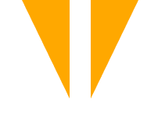

<h1 align="center">
  
</h1>

<h1 align="center">Sapar Delivery</h1>

  

 

<h1 align="center">
  
</h1>

 

## Summary

  - [Begin](#Begin)
  - [Requirement](#Requeriment)
  - [Installation](#Installation)
  - [Test](#Test)
  - [Deploy](#Deploy)
  - [Pattern to follow](#Padrão-to-follow)
  - [Author](#Author)
  - [Useful technologies](#Useful-technologies)

## Begin

Follow the instructions below to run the app.

### Requirements

What you need to run.

* **[Node v13.8.0](https://nodejs.org/en/)** - Install Node JS in your machine.

### Instalation

- Install all the dependencies.

Execute

    npm install

Or

    yarn install

- Start the project.
 
    npm start

Or

    yarn start

Note: We recommend to use yarn rather than npm . 
### Test

Executes the test

    npmn test

## Deploy

The deployment...

## Pattern 

  - [Contributor Covenant](https://www.contributor-covenant.org/) 
 
## Author

  - **Bat Devs**  -
   

## Technologies

  - JS
  - React-Native (Expo)
  - Axios
  - Node (Express)
  - Google Maps API
  - Firebase
  - Mongoose
  - Morgan
  - Socket.io
# 
